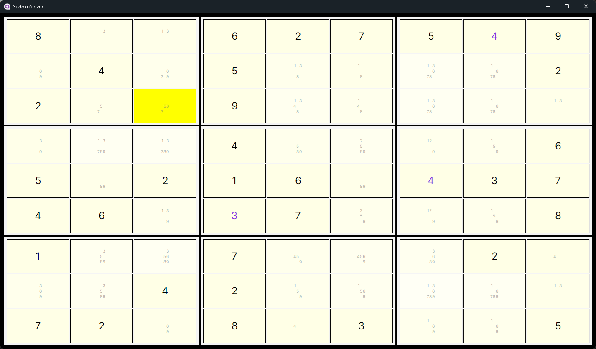
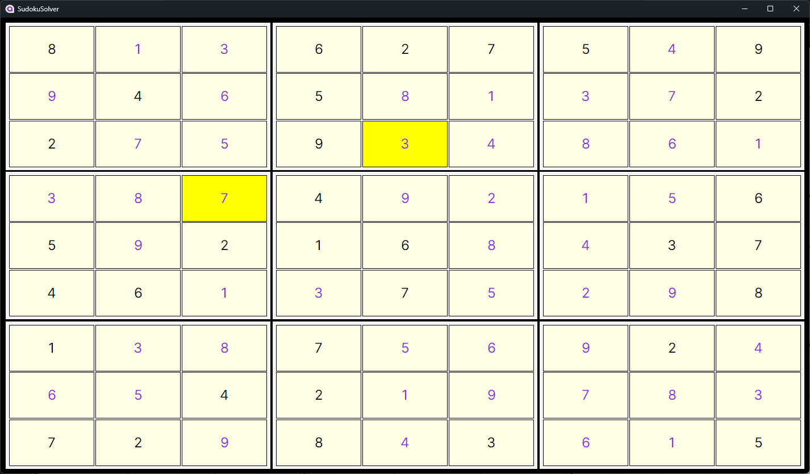

# AvaloniaSudokuSolver
My attempt to learn something about Avalonia. Tried it while also creating Sudoku Solver and learning about techniques to solve them.

## Solving proccess

## Finished Sudoku
With 2 guessed numbers after all rules failed.

